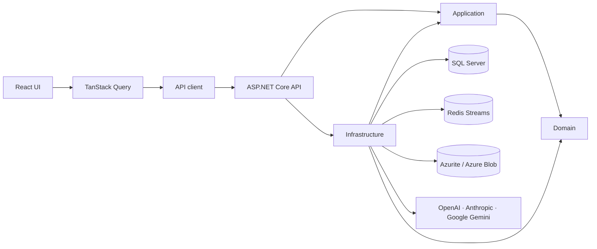

# Noxtend

Noxtend는 AI를 이용해 3D 에셋 제작 파이프라인을 자동화하는 스튜디오입니다.
현재 제품의 중심인 **Background Studio**는 소스 이미지를 분석하고, 장면 명세와
파츠 정보를 추출·분해한 뒤, 파츠마다 **정면·우측·후면·좌측 네 방향 이미지**를
생성합니다. 네 방향인 이유는 이후 3D 재구성 단계가 같은 물체를 여러 각도에서 찍은
이미지를 입력으로 받기 때문입니다.

> 현재 로컬 개발·검증용 프로젝트입니다. 인증이 구현되지 않았으므로 외부 네트워크에
> 공개 배포하면 안 됩니다.

## 현재 상태

| 영역 | 상태 |
|---|:---:|
| 앱 셸·사이드바·다크/라이트 테마 | ✅ 완료 |
| Tailwind CSS v4 + shadcn/ui 디자인 시스템 | ✅ 완료 |
| 이미지 업로드·작업 생성·조회·취소 | ✅ 완료 |
| 장면 분석 → 파츠 추출 → 파츠 분해 파이프라인 | ✅ 완료 |
| SQL Server·Redis Streams·Azurite 연동 | ✅ 완료 |
| OpenAI·Anthropic 텍스트 공급자 | ✅ 완료 |
| OpenAI·Google 이미지 공급자와 API 키 관리 | ✅ 완료 |
| 공급자·프롬프트·골든 샘플·단가 관리 | ✅ 완료 |
| 파츠 4방향 이미지 생성(정면·우측·후면·좌측) | ✅ 완료 |
| 방향 단위 재시도와 작업 부분 성공 | ✅ 완료 |
| 3D 재구성 단계 | ✅ 완료 — 2026-09-03 실 API 로 파츠 20개까지 확인 |
| 파츠 검수 게이트(승인 전까지 이미지 생성 보류) | ✅ 완료 |
| 검수 화면에서 상자 추가·삭제·이동·크기 조절 | ✅ 완료 |
| 캐릭터 제작 화면 | ✅ 완료 |
| 오브젝트 제작 화면 | ⏳ 준비 중 |
| 캐릭터 4면 레퍼런스 체이닝(정면→비정면 참조) | ⚠️ 부분 완료 — 아래 "미구현·가라 목록" 참고 |
| 파츠 좌표 정확도 | ⚠️ 부분 완료 — 아래 "미구현·가라 목록" 참고 |
| 인증·외부 공개 배포 | ⛔ 미지원 |

## 미구현·가라 목록

- **캐릭터 파츠 경계·회전 일관성이 완전하지 않음** (workstream D/E,
  `docs/archive/2026-08/character-tuning/character-tuning-workstream-d.spec.md`·`-e.spec.md`).
  2026-08-16 마이그레이션(`CharacterPromptWorkstreamDE`)으로 §5.5 정면 참조 앵커
  문구·회전 규칙·베이스바디 통짜화·부착 소품 분리·무기류 자세 정규화를 시드에
  반영했고, 같은 날 후속 마이그레이션(`CharacterPromptWorkstreamE5`)으로 스코프-분리
  충돌 대응(아래)도 반영했다(전부 DB 전용이 아니라 코드·마이그레이션 정본). 다만
  **실 API로 재검증한 적은 아직 없다** — 코드는 있지만 실제로 잘 작동하는지는 미확인:
  - ~~**스코프-분리 충돌**(workstream E §5 결정 ⑤, 이슈 4·12)~~ — **2026-08-16 결정·구현
    완료.** 힌트 타입의 시각적 연장(벨트 부착물·다리 갑주)은 분리 허용, 힌트와 무관한
    완전히 새 카테고리는 계속 금지하는 규칙으로 확정해 Extract 프롬프트에 반영했다.
    실 API 검증 전이라 실제로 지켜지는지는 미확인.
  - **재현성**(workstream E §1.6, 이슈 13) — **여전히 미해결.** 같은 원본 이미지로 두 번
    실행했는데 파츠 설명(하의의 좌우 비대칭 디자인)이 실행마다 다르게 나왔다. 프롬프트
    중복 서술을 정리해 분량은 줄였지만(가설을 검증한 건 아님), `temperature`/`seed`
    고정은 조사 결과 이 프로젝트가 쓰는 모델(OpenAI gpt-5 계열·Claude 4.5 이상)이 전부
    기본값 외 temperature를 거부해서 포기했다 — 원인(프롬프트 길이 vs LLM 샘플링
    변동성)은 여전히 미확정. 다음 대응은 반복 실행 검증뿐인데 비용 문제로 보류 중.
  - ~~참조 이미지 개수(1장/2장)에 따른 실제 토큰 사용량 차이가 비용 계산에 반영 안 됨~~
    — **2026-08-16 근사 반영(B안).** `gpt-image-2`가 장당 고정가($0.053)만으로 계산되던
    걸, OpenAI 공식 토큰 단가(텍스트입력 $5/이미지입력 $8/출력 $30, 100만 토큰당)로
    새 시행일 행을 추가해 보완했다. 텍스트·이미지 입력 토큰을 분리 저장하지 않는 지금
    구조 안에서, 참조 이미지가 텍스트보다 토큰을 훨씬 많이 먹는다는 근거로 입력 전체에
    이미지 단가($8)를 블렌디드 근사로 적용한다(과소 청구보다 안전한 쪽) — 정확한 3단가
    분리(텍스트/이미지/출력)는 아니고, 근사치다.

- **파츠 좌표가 정확하지 않다 — 긴 옷의 아래 끝을 놓친다.**
  2026-09-03 저장된 원본을 픽셀로 재서 확인했다. 인물의 위·아래 끝은 모델 좌표와
  1% 안쪽으로 맞는다(실측 0.0282·0.9955 vs 모델 0.025·0.985). **전역 이동도 배율도
  아니라서 상수 보정으로는 못 고친다** — 실제로 `y × 0.935/0.995` 를 넣어 봤고
  되돌렸다(`ba0a1f9` → `698e384`). 틀리는 것은 긴 파츠의 높이다: 상의가 0.37 에서
  끊기는데 코트 자락은 0.55 까지 가고, 하의가 0.765 에서 끊기는데 바지는 0.85 까지
  간다. 프롬프트로 고치려는 시도는 두 번 실패했으므로(workstream O 는 되돌림)
  3차 시도를 하지 않는다. 지금은 **검수 화면에서 사람이 상자를 끌어 고친다.**

- **프론트 e2e 16 개가 실패 상태다** (`tests/e2e/mesh.spec.ts`,
  `character-studio-e2e.spec.ts`). 2026-09-03 확인했고 **이 브랜치의 변경과 무관하다** —
  원본 코드에서도 같은 16 개가 같은 이유로 실패한다(`run-result` 가 안 뜬다).
  원인 조사는 안 했다.

- ~~**이미지 생성 레이트리밋 대응 없음**~~ (`docs/archive/2026-08/character-tuning/generation-rate-limiting.spec.md`).
  **2026-08-16 결정·구현 완료.** 재시도에 지수 백오프(1차 5초/2차 30초/3차부터 2분 +
  지터)를 걸고, 호출 전에 Redis로 남은 요청 수를 확인해 필요하면 초기화 시각까지
  기다리는 사전 예방(OpenAI 한정, 응답 헤더 기반)까지 구현했다. 독립 리뷰로 백오프가
  스위퍼 주기(60초)에 종속되던 버그도 찾아 고쳤다. 알려진 한계 2가지는 의도적으로
  안 고쳤다 — 동시에 몰리는 첫 버스트는 못 막음(레이스 컨디션 비원자적, 반응형
  백오프가 대신 받침), 429 응답의 헤더는 파싱 안 하고 버림. **실 API로 재검증한 적은
  아직 없다.**

관리자 화면에서 공급자별 API 키를 등록하면 앱이 지원하는 용도에 따라 연결을 구분합니다.
OpenAI는 텍스트 분석과 이미지 생성, Anthropic은 텍스트 분석, Google Gemini는 이미지
생성에 사용하며, Tripo와 Meshy는 3D 재구성에 사용합니다. API 키 하나를 해당 공급자의
지원 용도에 공통으로 사용합니다.

## 주요 사용자 흐름

```text
이미지 업로드
  → 텍스트 AI 공급자·모델 선택
  → 작업 생성
  → 장면 분석(Analyze)
  → 파츠 추출(Extract)
  → 파츠 명세 분해(Decompose)
  → [검수 게이트] 사람이 파츠를 확인·추가·삭제하고 상자를 고친 뒤 전체 승인
  → [가려진 파츠가 있으면] 서술 재작성(RewriteDescriptions)
  → 파츠 × 4방향 이미지 생성(Generate)
  → [3D 를 켰으면] 파츠마다 3D 재구성(Reconstruct)
  → 결과 저장·조회
```

앞의 세 단계는 작업마다 공정이 하나씩이지만, 생성은 분해가 끝나야 파츠 수를 알 수 있어
그 뒤에 **파츠 수 × 4방향**만큼 공정으로 팬아웃됩니다. 방향마다 공정이 독립이므로 한
방향이 실패해도 나머지는 그대로 진행되고, 실패한 방향만 화면에서 다시 생성할 수
있습니다. 일부 방향만 성공한 작업은 성공이 아니라 **부분 성공**으로 끝납니다 — 이미지가
빈 파츠가 있다는 사실이 다음 3D 단계의 입력 조건이기 때문입니다.

접수 화면의 체크박스 두 개가 대괄호로 표시한 단계를 켜고 끕니다.

- **파츠 검수하기** — 기본 켬. 끄면 분해 직후 이미지가 곧바로 나갑니다. 파츠 26 개면
  이미지 104 장이므로 기본을 켬으로 둡니다.
- **이미지 생성 완료 후 검수 없이 3D 까지 생성하기** — 기본 끔. 켜면 접수에 3D
  공급자·모델이 실려 나가고, 파츠의 4방향이 모이는 대로 3D 가 자동으로 돕니다
  (파츠당 약 $0.40). 끄면 두 필드를 보내지 않아 이미지까지만 만듭니다.

검수 게이트에서는 탐지된 상자를 끌어 옮기거나 손잡이 8 개로 크기를 고칠 수 있습니다.
상자를 옮기면 가림 관계를 다시 계산하고, 관계가 달라진 파츠의 서술만 승인 시 한 번
다시 씁니다.

작업 주소는 `/background/{jobId}`입니다. 페이지를 떠나거나 새로고침해도 같은 URL로
진행 상태와 결과를 다시 열 수 있습니다.

주요 화면은 다음과 같습니다.

| 경로 | 기능 |
|---|---|
| `/` | 실행 중 작업과 최근 작업 |
| `/background` | 이미지 업로드와 새 작업 시작 |
| `/background/{jobId}` | 배경 진행 상태와 결과 조회 |
| `/character` | 캐릭터 이미지 업로드와 성별·파츠 힌트 설정 |
| `/character/{jobId}` | 캐릭터 진행 상태와 결과 조회 |
| `/admin/providers` | AI 공급자와 API 키 관리 |
| `/admin/prompts` | 단계별 프롬프트 버전 관리 |
| `/admin/golden` | 골든 샘플과 실행 결과 판정 |
| `/admin/golden/{sampleId}` | 골든 샘플 상세 실행 결과 조회 |
| `/admin/prices` | 모델 단가 관리 |
| `/admin/calls` | AI 호출 로그 내역 조회 |
| `/object` | 준비 중 화면 |

## 아키텍처



백엔드는 프로젝트 참조로 Clean Architecture의 방향을 강제합니다.

```text
Noxtend.Api
  ├─> Noxtend.Application ─> Noxtend.Domain
  └─> Noxtend.Infrastructure ─> Application + Domain + Tuning

Noxtend.Tuning.Application ─> Noxtend.Tuning.Domain + Noxtend.Domain
```

핵심 원칙은 다음과 같습니다.

- **SQL Server가 작업 상태의 정본**이고 Redis Streams는 공정 디스패치에만 사용합니다.
- API와 Worker는 같은 ASP.NET Core 프로세스에서 실행됩니다.
- Worker는 리스 갱신과 협조적 취소를 사용하며, Sweeper가 유실 가능 공정을 재적재합니다.
- 원본과 생성 이미지는 Blob Storage에 저장하고, 저장 키는 서버가 생성합니다.
- 공급자 API 키는 Data Protection으로 암호화하고 응답에는 마스킹된 값만 전달합니다.
- 이미지·텍스트 호출은 모두 같은 내역으로 기록하고, 비용은 단가표가 선언한 방식으로
  계산합니다. 토큰 단가가 등록된 모델은 공급자가 준 실측 토큰을, 장당 단가만 등록된
  모델은 그 정액을 씁니다. 단가가 없는 모델은 0원이 아니라 **미등록**으로 남깁니다.
- API 응답은 `{ data, error }` 봉투를 사용합니다.

Kubernetes 리소스, 포트, 데이터 흐름과 영속성은
[인프라 구성도](docs/infrastructure.md)를 참고하세요.

## 기술 스택

| 영역 | 기술 |
|---|---|
| Frontend | React 19, TypeScript, Vite 6, React Router 7 |
| Data fetching | TanStack Query 5 |
| UI | Tailwind CSS 4, shadcn/ui, Radix UI |
| Backend | ASP.NET Core, .NET 10 |
| Persistence | EF Core, SQL Server 2022 |
| Task dispatch | Redis Streams |
| Object storage | Azure Blob Storage, Azurite |
| AI providers | OpenAI·Anthropic 텍스트 분석, OpenAI·Google Gemini 이미지 생성 |
| Local infrastructure | Docker Desktop, Kubernetes |
| Test | Vitest, Playwright, xUnit |

## 저장소 구조

```text
.
├── apps/
│   ├── frontend/
│   │   ├── src/app/                 # Query와 앱 조립
│   │   ├── src/domain/              # 클라이언트 도메인 타입·규칙
│   │   ├── src/infra/               # API·테마·레이아웃 어댑터
│   │   ├── src/features/            # 화면과 앱 셸
│   │   ├── src/components/ui/       # shadcn/ui 프리미티브
│   │   ├── src/routes/              # 라우트·내비게이션 정본
│   │   └── tests/e2e/               # Playwright E2E
│   └── backend/
│       ├── Noxtend.Api/             # 컨트롤러·DI·Worker 호스팅
│       ├── Noxtend.Application/     # 유스케이스·오케스트레이션
│       ├── Noxtend.Domain/          # 엔티티·상태 전이·Port
│       ├── Noxtend.Infrastructure/  # EF·Redis·Blob·AI·보안
│       ├── Noxtend.Tuning.Domain/   # 프롬프트·호출·골든·단가 도메인
│       ├── Noxtend.Tuning.Application/
│       └── Noxtend.Tests/           # xUnit 테스트
├── deploy/
│   ├── local-up.sh                  # 로컬 전체 스택 기동
│   └── k8s/                         # API·MSSQL·Redis·Azurite 매니페스트
├── docs/
│   ├── 01-plan/                     # 활성 Plan
│   ├── 02-design/                   # 활성 Design
│   ├── 03-analysis/                 # 활성 Check·Act 분석
│   ├── 04-report/                   # 활성 완료 보고서
│   ├── infrastructure.md            # 인프라 구성도와 운영 절차
│   └── archive/                     # 완료된 PDCA 문서
├── packages/proto/                  # 향후 실행 백본 계약 경계
└── plans/                           # 완료된 실행 계획
```

## 로컬 실행

### 요구 사항

- Node.js 24 이상
- pnpm 11.9 이상
- .NET 10 SDK
- Docker Desktop + Kubernetes
- `kubectl`

Docker Desktop의 Kubernetes가 활성화되어 있고 다음 명령이 `docker-desktop`을 반환해야
합니다.

```bash
kubectl config current-context
```

### 1. 의존성 설치

```bash
pnpm install
```

### 2. 로컬 Secret 준비

`deploy/k8s/secrets.yaml`이 아직 없을 때만 예시 파일을 복사하고 SQL Server 비밀번호를
변경합니다. `MSSQL_SA_PASSWORD`와 DB 연결 문자열 안의 비밀번호는 같아야 합니다.

```bash
cp deploy/k8s/secrets.example.yaml deploy/k8s/secrets.yaml
```

`deploy/k8s/secrets.yaml`은 Git에서 제외됩니다. 실제 공급자 API 키는 앱 실행 후
`/admin/providers`에서 등록합니다.

### 3. 백엔드와 인프라 실행

다음 스크립트가 API 이미지를 빌드하고 Kubernetes에 반입한 뒤 API·SQL Server·Redis·
Azurite를 적용하고 `/health`를 확인합니다.

```bash
deploy/local-up.sh
```

프론트엔드가 API를 계속 호출할 수 있도록 별도 터미널에서 포트 포워딩을 유지합니다.

```bash
kubectl -n noxtend port-forward svc/api 18080:8080
```

첫 SQL Server 기동은 시스템 데이터베이스 생성 때문에 30초에서 2분 정도 걸릴 수
있습니다.

### 4. 프론트엔드 실행

`apps/frontend/.env.development.local`은 개발 API 주소를 다음과 같이 설정합니다.

```dotenv
VITE_API_BASE_URL=http://localhost:18080
```

개발 서버를 실행합니다.

```bash
pnpm dev
```

| 대상 | 주소 |
|---|---|
| Frontend | `http://localhost:5173` |
| API | `http://localhost:18080` |
| Health | `http://localhost:18080/health` |
| Liveness | `http://localhost:18080/health/live` |

### 5. 실행 확인

```bash
curl -s http://localhost:18080/health | jq
```

정상 응답은 다음과 같습니다.

```json
{
  "data": {
    "db": "ok",
    "redis": "ok",
    "imageDecoder": "ok",
    "blob": "ok"
  },
  "error": null
}
```

### 클라이언트만 실행

```bash
pnpm dev
```

API가 없으면 앱 셸은 열리지만 서버 데이터가 필요한 화면에는 연결 실패 상태가
표시됩니다.

### 백엔드 빌드·테스트만 실행

```bash
dotnet build apps/backend/Noxtend.slnx
dotnet test apps/backend/Noxtend.slnx
```

로컬 API의 직접 `dotnet run`보다 `deploy/local-up.sh`를 권장합니다. 기본 연결 문자열이
Kubernetes 내부 서비스 이름(`mssql`, `redis`, `azurite`)을 사용하기 때문입니다.

## 검증

### 코드 스타일

공통 들여쓰기·줄바꿈은 루트 [`.editorconfig`](.editorconfig)를 따른다.
C#은 기존 공백 4칸과 Allman 중괄호를 유지하며, 이름·`var`·생성자 표현은 주변 코드에 맞춘다.
프런트엔드는 공백 2칸, 작은따옴표, 세미콜론 생략을 유지하고 Prettier로 형식을 맞춘다.
ESLint는 타입·React 훅·계층 경계를, Oxlint는 기존 Tailwind 클래스 규칙을 검사한다.
`eslint-config-prettier`로 포맷터와 린터의 형식 규칙 충돌을 막는다.

저장소 루트에서 다음 명령을 실행한다. 포맷 대상은 `apps/frontend`이며 C#은 포함하지 않는다.

```bash
pnpm format
pnpm format:check
pnpm lint
```

주석은 `// 검수 승인 전 생성 보류`처럼 짧은 명사구로 끝낸다. JSX·CSS·YAML·shell 등
`//`가 유효하지 않은 위치에서는 해당 문법의 주석 구문을 사용한다. 자세한 작업 절차와
상황별 스킬은 [`AGENTS.md`](AGENTS.md)에서 확인한다.

이 구성은 [State of JavaScript 2025의 Utilities 조사](https://2025.stateofjs.com/en-US/other-tools/)에서
정기 사용 응답이 가장 많은 ESLint와 Prettier를 기준으로 선택했다. 형식과 코드 품질 검사를
분리하는 방식은 [Prettier 공식 가이드](https://prettier.io/docs/integrating-with-linters.html)를 따른다.

### 회귀 검증

```bash
# Frontend
pnpm format:check
pnpm typecheck
pnpm lint
pnpm test
pnpm test:e2e
pnpm build

# Backend
dotnet test apps/backend/Noxtend.slnx
```

### 유료 스모크 테스트

기본 테스트는 외부 공급자에 **돈을 쓰지 않습니다.** LLM·이미지·3D 어댑터 테스트는 전부
가짜 HTTP 핸들러를 씁니다.

예외가 하나 있습니다. 3D 제작은 공급자가 실제로 무엇을 돌려주는지, 결과 링크의 5분
만료가 정말 5분인지, GLB 가 정말 파싱되는지를 한 번은 진짜로 눌러 봐야 알 수 있습니다.
그 한 번을 재현 가능한 형태로 남겨 두었고, **환경 변수 둘이 모두 있을 때만** 돕니다.

```bash
TRIPO_SMOKE_TEST=1 TRIPO_API_KEY=... \
  dotnet test apps/backend/Noxtend.slnx --filter TripoSmokeTests
```

실행하면 Tripo P1 작업이 **한 건 실제로 생성되고 크레딧이 소모됩니다.** 둘 중 하나라도
없으면 실패가 아니라 건너뜀으로 끝나므로, CI 가 붉어지지 않습니다.

## Slack 커밋 알림

루트의 `azure-pipelines.yml`은 `main`에 직접 push되거나 PR이 merge된 뒤 실행되어 해당
build의 커밋과 변경 파일을 Slack으로 전송합니다. 수동 실행과 PR validation에서는 알림
step을 건너뜁니다.

### Azure Pipeline 설정

1. Slack App에서 Incoming Webhook을 활성화하고 알림 채널의 webhook URL을 발급합니다.
2. Azure DevOps에서 이 저장소를 소스로 하는 YAML pipeline을 만들고
   `/azure-pipelines.yml`을 선택합니다.
3. Pipeline variable `SLACK_WEBHOOK_URL`에 webhook URL을 등록하고 **Keep this value
   secret**을 활성화합니다.
4. Pipeline의 build service identity가 현재 프로젝트의 build를 조회할 수 있는지
   확인합니다. 연관 커밋 조회 권한이 없으면 source commit 하나로 자동 대체됩니다.

Webhook URL은 secret이므로 YAML, variable group 예시, 로그에 실제 값을 기록하지 않습니다.
Pipeline은 `System.AccessToken`을 환경 변수로 명시적으로 전달해 Build Changes API에서
한 push에 포함된 커밋을 최대 20개까지 읽습니다. Slack에는 최대 10개를 표시하고 나머지
개수를 덧붙입니다.

### 로컬 payload 확인

실제 Slack 전송 없이 현재 commit의 payload를 확인할 수 있습니다.

```bash
pwsh -NoLogo -NoProfile \
  -File .github/scripts/Send-SlackCommitNotification.ps1 \
  -CollectionUri 'https://dev.azure.com/{organization}/' \
  -ProjectName '{project}' \
  -RepositoryName '{repository}' \
  -CommitSha "$(git rev-parse HEAD)" \
  -DryRun
```

알림 스크립트의 자동 테스트는 다음 명령으로 실행합니다.

```bash
pwsh -NoLogo -NoProfile \
  -File .github/scripts/tests/Send-SlackCommitNotification.Tests.ps1
```

## 종료와 정리

프론트엔드와 포트 포워딩은 각각 실행 중인 터미널에서 `Ctrl+C`로 종료합니다.

Pod만 중지하고 PVC 데이터를 유지하려면 Deployment를 축소합니다.

```bash
kubectl -n noxtend scale deployment api mssql redis azurite --replicas=0
```

전체 로컬 데이터를 삭제할 때만 다음 명령을 사용합니다. `mssql-data`, `azurite-data`,
`api-dataprotection` PVC도 함께 삭제됩니다.

```bash
kubectl delete namespace noxtend
```

## 보안 경계

- 인증이 없으므로 로컬·사내망 밖에 배포하지 않습니다.
- 공급자 API 키와 실제 연결 문자열을 저장소에 커밋하지 않습니다.
- 업로드 파일은 서버에서도 형식과 크기를 검증합니다.
- 원본 파일명이나 사용자 입력을 Blob 키로 사용하지 않습니다.
- 외부 공급자의 원문 오류를 사용자 응답에 그대로 전달하지 않습니다.
- 프로덕션에서는 공개 NodePort 대신 인증이 적용된 Ingress 또는 내부 Service를
  사용해야 합니다.

## 문서

- [캐릭터 튜닝 진행 상황](docs/specs/character-tuning-progress.md)
- [인프라 구성도와 로컬 운영](docs/infrastructure.md)
- [Kubernetes 상세 기동 절차](deploy/k8s/README.md)
- [Background Studio Plan](docs/archive/2026-07/background-studio/background-studio.plan.md)
- [Background Studio Design](docs/archive/2026-07/background-studio/background-studio.design.md)
- [파츠 이미지 생성 Design](docs/archive/2026-08/part-generation/part-generation.design.md)
- [파츠 이미지 생성 완료 보고서](docs/archive/2026-08/part-generation/part-generation.report.md)
- [Design System 완료 보고서](docs/archive/2026-08/design-system/design-system.report.md)
- [2026-08 PDCA 아카이브](docs/archive/2026-08/_INDEX.md)
