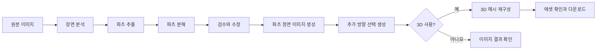
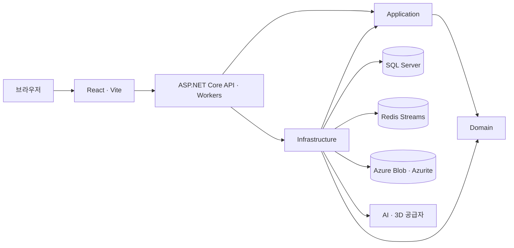

# Noxtend

Noxtend는 참조 이미지를 검수 가능한 2D 배경과 3D 에셋으로 바꿉니다. 2D 배경 스튜디오는 배경 레이어·반복 타일·선택형 루프와 PNG/ZIP을 제공하며, 기존 Background·Character Studio는 파츠·방향별 이미지와 선택형 3D 모델을 만듭니다.

> 현재 지원 범위는 로컬 개발·평가입니다. 2D 흐름은 Fake·픽셀 fixture·격리 DB로 검증했으며, 실 AI의 반복 경계·시점 재구성·루프 자연스러움은 아직 확인하지 않았습니다. Object Studio와 사용자 인증은 아직 구현하지 않아 외부에 공개 배포할 수 없습니다.

## 현재 제공 범위

| 제작 공간 | 현재 기능 |
| --- | --- |
| **2D Background** | 이미지 입력, 횡스크롤·탑다운·아이소메트릭 시점 선택, 레이어·반복 타일 제작 계획과 기준 검수, 선택형 4·8프레임 루프, 프레임 재생성·승인, PNG 다운로드·전체/명시적 일부 ZIP 내보내기 |
| **Background** | 장면 분석, 파츠 추출·분해, 설명·경계 검수, 파츠 정면 이미지 생성, 추가 방향 이미지 요청, 선택형 3D 재구성 |
| **Character** | 캐릭터 이미지와 성별·파츠 힌트 입력, 추출 결과 검수, 이미지 생성, 선택형 3D 재구성 |
| **Admin** | AI 공급자 설정, 프롬프트 버전·골든 샘플·모델 단가·호출 내역 관리 |

검수 기능을 켜면 승인 전까지 이미지 생성을 보류합니다. 파츠마다 정면 이미지를 먼저 만들고, 우측·후면·좌측 이미지는 사용자가 요청할 때 생성합니다. 방향별 작업은 독립적이라 실패한 방향만 재시도할 수 있습니다.

텍스트 분석은 OpenAI·Anthropic·Google Gemini, 이미지 생성은 OpenAI·Google Gemini, 3D 재구성은 Tripo·Meshy를 지원합니다. 공급자 설정에 따라 선택 가능한 기능과 모델은 달라집니다.

## 작업 흐름

2D 배경은 `/2d/background`에서 원본 업로드 또는 기존 결과의 작업·이미지 ID 쌍으로 시작합니다. 제작 계획 승인 → 기준 이미지 검수 → 루프를 선택한 대상의 프레임 검수 → 포함·제외 대상을 확인한 ZIP 내보내기로 진행합니다. 정적 대상은 1프레임이며 루프는 기준을 포함해 4·8프레임입니다. 일부 승인 결과만 명시적으로 내보내면 부분 성공으로 종료합니다. 시점·유형·투명·생성 크기를 지원하는 모델만 접수할 수 있고 미등록 단가는 비용 미확인으로 표시합니다.

기존 3D 배경·캐릭터 흐름은 다음과 같습니다.



## 아키텍처

API와 호스팅 Worker는 하나의 ASP.NET Core 프로세스에서 실행됩니다. 작업 상태의 정본은 SQL Server이고, Redis Streams는 작업 전달에만 사용합니다. 원본 이미지와 생성 결과는 Blob Storage에 저장합니다.



| 영역 | 기술 |
| --- | --- |
| Frontend | React 19, TypeScript, Vite, React Router, TanStack Query, Tailwind CSS 4, shadcn/ui |
| Backend | C#, ASP.NET Core, .NET 10, EF Core |
| 데이터·작업 | SQL Server 2022, Redis Streams, Azure Blob Storage 또는 Azurite |
| 공급자 | OpenAI, Anthropic, Google Gemini, Tripo, Meshy |
| 테스트 | Vitest, Playwright, xUnit, Testcontainers |

## 로컬 실행

### 준비물

- Docker Desktop의 Kubernetes와 `kubectl`
- Node.js 24 이상, pnpm 11.9.0
- Backend 빌드·테스트용 .NET 10 SDK

### API와 로컬 서비스 실행

```bash
git clone https://github.com/boinred/Noxtend.git
cd Noxtend
pnpm install
cp deploy/k8s/secrets.example.yaml deploy/k8s/secrets.yaml
```

`deploy/k8s/secrets.yaml`의 `MSSQL_SA_PASSWORD`와 `ConnectionStrings__Db`에 같은 SQL Server 비밀번호를 설정합니다. 실제 비밀번호와 공급자 키는 Git에 커밋하지 마세요.

API 이미지를 빌드하고 SQL Server·Redis·Azurite·API를 기동합니다.

```bash
deploy/local-up.sh
```

스크립트는 `/health`를 확인한 뒤 임시 포트 포워딩을 종료합니다. `-d`(또는 `--detach`)를 붙이면 빌드·배포·확인 후 포트 포워딩을 백그라운드에 남기고 터미널로 돌아옵니다. 출력된 PID와 로그 경로로 확인하고 `kill <PID>`로 종료합니다. `--forward`는 터미널에서 `Ctrl+C`까지 유지하는 방식입니다. API가 재시작되면 두 방식 모두 포워딩이 끊기므로 다시 연결해야 합니다.

```bash
deploy/local-up.sh -d
```

### Frontend 실행

기본 API 주소는 `apps/frontend/.env.development`의 `http://localhost:18080`입니다.
PowerShell·Bash·zsh 모두 환경변수를 따로 입력하지 않고 개발 서버를 실행합니다.

```bash
pnpm dev
```

다른 API 주소를 사용하려면 Git에서 제외된 `apps/frontend/.env.development.local`의
`VITE_API_BASE_URL`로 덮어씁니다.

`http://localhost:5173`을 엽니다. API와 의존 서비스 상태는 `http://localhost:18080/health`에서 확인할 수 있습니다. 실제 AI 작업을 실행하려면 `/admin/providers`에서 공급자 키를 등록해야 합니다.

## 변경 검증

저장소 루트의 아래 검증 명령은 Frontend만 대상으로 합니다.

```bash
pnpm lint
pnpm typecheck
pnpm test
pnpm build
pnpm test:e2e
```

Backend 빌드·테스트에는 .NET 10이 필요합니다. 전체 테스트는 Docker 기반 SQL Server·Redis fixture를 사용하며, 아래 회귀 명령은 유료 공급자 smoke 테스트를 제외합니다.

```bash
dotnet build apps/backend/Noxtend.slnx
dotnet test apps/backend/Noxtend.slnx --filter 'FullyQualifiedName!~TripoSmokeTests&FullyQualifiedName!~SimilaritySmokeTests'
```

테스트 환경과 유료 smoke 조건은 [검증 안내](.agents/skills/noxtend-workflow/references/verification.md)를 참고하세요.

## 범위와 보안

- Object Studio, 2D 캐릭터·오브젝트와 텍스트 입력만으로 배경을 만드는 기능은 아직 제공하지 않습니다.
- 인증·인가가 없습니다. localhost 또는 격리된 개발망에서만 실행하고 API·관리자 화면을 외부에 공개하지 마세요.
- 공급자 키는 ASP.NET Core Data Protection으로 암호화합니다. 공급자 설정이 든 DB를 보존할 때는 Data Protection 키 링도 함께 보존해야 합니다.
- AI 결과는 모델에 따라 달라질 수 있습니다. 이미지 생성 전에 검수 화면에서 파츠 경계를 보정할 수 있습니다.

## 개발 문서

- [제품 방향](PRODUCT.md) · [디자인 시스템](DESIGN.md)
- [저장소 작업·에이전트 지침](AGENTS.md)
- [Backend 개발 지침](apps/backend/AGENTS.md) · [Frontend 개발 지침](apps/frontend/AGENTS.md)
- [에이전트 개발 문서 색인](docs/xHuman/README.md)
- [2D 배경 검증·품질 경계·판단 기록](docs/superpowers/plans/2026-10-06-2d-background-sprites-execution.md)
- [인프라 개요](docs/infrastructure.md) · [Kubernetes 로컬 실행 안내](deploy/k8s/README.md)
