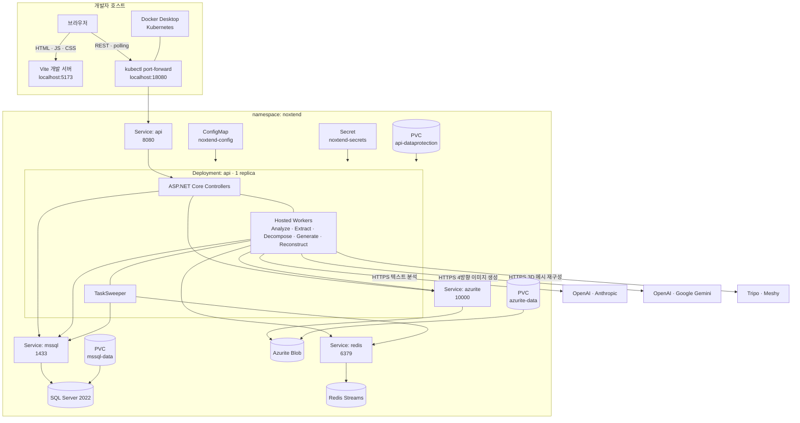
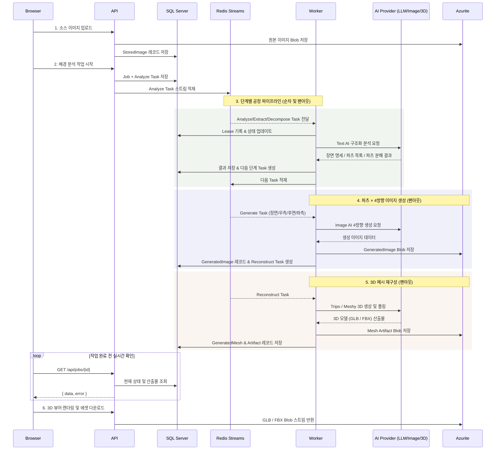

# Noxtend 인프라 구성도

Noxtend의 로컬 인프라는 Docker Desktop Kubernetes의 `noxtend` 네임스페이스에서
실행됩니다. 프론트엔드는 호스트의 Vite 개발 서버에서 실행되고, 브라우저가
`kubectl port-forward`를 통해 Kubernetes 내부 API에 접근합니다.

## 전체 구성



브라우저는 Vite를 프록시로 사용하지 않습니다. 개발 모드의
`VITE_API_BASE_URL=http://localhost:18080`을 읽어 API 포트 포워딩을 직접 호출합니다.

## 런타임 구성 요소

| 구성 요소 | 역할 | 영속성 |
|---|---|---|
| `api` | HTTP API, EF 마이그레이션, 5개 단계 Worker와 Sweeper 호스팅 | Data Protection 키 PVC |
| `mssql` | 작업·공정·파츠·생성 이미지·3D 메시·공급자·튜닝 데이터의 정본 | `mssql-data` 5Gi PVC |
| `redis` | 단계별 Redis Stream과 Worker 디스패치 | 없음 — 정본이 아님 |
| `azurite` | 원본/생성 이미지 및 3D GLB/FBX 에셋 Blob Storage 에뮬레이터 | `azurite-data` 2Gi PVC |

API Pod는 시작할 때 EF Core 마이그레이션을 적용합니다. 배포 전략은 단일 replica와
`Recreate`이며, Data Protection 키는 `api-dataprotection` 128Mi PVC의 `/keys`에
보관됩니다.

Redis에는 의도적으로 PVC가 없습니다. 메시지가 사라져도 작업 상태는 SQL Server에
남고 Sweeper가 준비된 공정을 다시 Redis에 적재합니다.

## 요청과 작업 데이터 흐름



파이프라인은 파츠 수에 따라 **파츠 수 × 4방향 이미지 생성(Generate)** 및 **파츠 단위 3D 메시 재구성(Reconstruct)** 공정으로 자동 팬아웃됩니다. 생성된 4방향 텍스처 이미지와 최종 3D 모델(GLB, FBX)은 Azurite Blob에 안전하게 영속화되며, 브라우저의 3D 뷰어 및 다운로드 API(`/api/generated-meshes/{id}`)를 통해 실시간으로 확인 및 추출할 수 있습니다.

## 네트워크와 포트

| 위치 | 주소/포트 | 용도 | 노출 범위 |
|---|---|---|---|
| 호스트 | `localhost:5173` | Vite 프론트엔드 | 로컬 |
| 호스트 | `localhost:18080` | `kubectl port-forward` API | 로컬 |
| 클러스터 | `api:8080` | ASP.NET Core API | 네임스페이스 내부 |
| 클러스터 | `mssql:1433` | SQL Server | 네임스페이스 내부 |
| 클러스터 | `redis:6379` | Redis Streams | 네임스페이스 내부 |
| 클러스터 | `azurite:10000` | Blob API | 네임스페이스 내부 |
| 클러스터 | `azurite:10001` | Queue API | 네임스페이스 내부 |
| 클러스터 | `azurite:10002` | Table API | 네임스페이스 내부 |

`api` Service에는 로컬용 NodePort `30080`도 선언되어 있지만, Docker Desktop의
kind 기반 클러스터에서는 호스트 노출이 일정하지 않으므로 공식 개발 경로는
`localhost:18080` 포트 포워딩입니다.

## 설정과 비밀

### ConfigMap: `noxtend-config`

| 키 | 기본값 | 의미 |
|---|---:|---|
| `ASPNETCORE_ENVIRONMENT` | `Development` | 개발 환경 |
| `ASPNETCORE_URLS` | `http://+:8080` | 컨테이너 리스닝 주소 |
| `DataProtection__KeysPath` | `/keys` | 암호화 키 링 경로 |
| `Jobs__LeaseSeconds` | `120` | 공정 리스 시간 |
| `Jobs__LeaseRenewSeconds` | `15` | 리스 갱신 주기 |
| `Jobs__SweepIntervalSeconds` | `60` | Sweeper 실행 주기 |
| `Jobs__MaxAttempts` | `3` | 공정 최대 시도 횟수 |
| `Llm__UseFake` | `false` | 실제 LLM 어댑터 사용 |

### Secret: `noxtend-secrets`

| 키 | 의미 |
|---|---|
| `MSSQL_SA_PASSWORD` | 로컬 SQL Server SA 비밀번호 |
| `ConnectionStrings__Db` | API의 SQL Server 연결 문자열 |
| `ConnectionStrings__Blob` | API의 Azurite 연결 문자열 |
| `ConnectionStrings__Redis` | API의 Redis 연결 문자열 |

실제 값은 Git에서 제외된 `deploy/k8s/secrets.yaml`에만 둡니다. 템플릿은
`deploy/k8s/secrets.example.yaml`이며, 공급자 API 키는 Kubernetes Secret이 아니라
관리자 화면에서 등록한 뒤 Data Protection으로 암호화해 DB에 저장합니다.

## 상태 확인

| 엔드포인트 | 의미 | 실패 시 동작 |
|---|---|---|
| `GET /health/live` | API 프로세스 생존 여부 | Kubernetes liveness/readiness Probe 실패 |
| `GET /health` | DB·Redis·Blob 의존성 상태 | `503`과 실패한 의존성 반환 |

Kubernetes Probe가 `/health`가 아닌 `/health/live`를 사용하는 것은 의도적입니다.
Redis 같은 의존성이 잠시 끊겨도 API Pod를 Service에서 제거하지 않아야 클라이언트가
구조화된 `503` 응답을 받고 장애 상태를 표시할 수 있습니다.

```bash
curl -s http://localhost:18080/health | jq
kubectl -n noxtend get pods
kubectl -n noxtend logs deploy/api --tail=100
```

## 기동 순서

1. Docker Desktop과 Kubernetes 활성화
2. `deploy/k8s/secrets.yaml` 준비
3. `deploy/local-up.sh` 실행
4. 모든 Deployment가 Available 상태가 될 때까지 대기
5. 별도 터미널에서 API 포트 포워딩 유지
6. `pnpm dev`로 프론트엔드 실행

```bash
deploy/local-up.sh
kubectl -n noxtend port-forward svc/api 18080:8080
pnpm dev
```

`deploy/local-up.sh`는 다음 작업을 자동화합니다.

1. `noxtend-api:local` 이미지 빌드
2. Docker Desktop Kubernetes의 containerd로 이미지 반입
3. namespace·Secret·4개 워크로드 적용
4. API Deployment 재시작과 준비 대기
5. 임시 포트 포워딩을 통한 `/health` 확인

매니페스트만 변경했고 API 이미지를 다시 만들 필요가 없다면 다음 명령을 사용할 수
있습니다.

```bash
deploy/local-up.sh --skip-build
```

## 종료와 데이터 수명

프론트엔드와 포트 포워딩은 각 터미널에서 `Ctrl+C`로 종료합니다. Deployment만
축소하면 PVC 데이터는 유지됩니다.

```bash
kubectl -n noxtend scale deployment api mssql redis azurite --replicas=0
kubectl -n noxtend scale deployment api mssql redis azurite --replicas=1
```

다음 명령은 namespace와 세 PVC를 삭제하므로 로컬 DB·Blob·암호화 키를 복구할 수
없습니다.

```bash
kubectl delete namespace noxtend
```

## 보안과 배포 제한

- 현재 인증이 없어 외부 공개 배포를 금지합니다.
- `deploy/k8s/secrets.yaml`과 공급자 키를 커밋하지 않습니다.
- 외부 배포에서는 NodePort 대신 인증이 적용된 Ingress 또는 내부 Service를 사용합니다.
- 실제 Azure와 관리형 Redis를 사용할 때도 Domain/Application 계약은 바뀌지 않고
  연결 문자열과 Infrastructure 어댑터만 교체합니다.

더 자세한 수동 Kubernetes 절차는
[`deploy/k8s/README.md`](../deploy/k8s/README.md)를 참고하세요.
